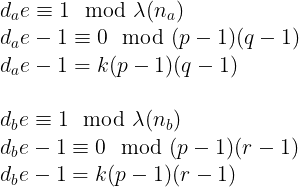
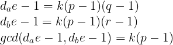
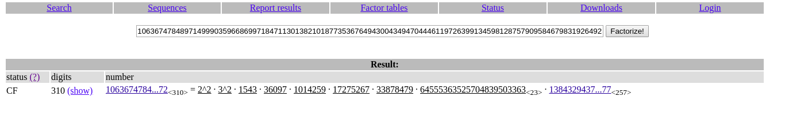

# alice_bob_dave (Crypto)
## Description
```
Alice and Bob are sending their flags to Dave. But sadly Dave lost the modulus :( Try to retrive the flag!
```
## Files
- [chall.py](public/chall.py)
- [out.txt](public/out.txt)

We are given a tar.gz file extract it got the two files

chall.py
```py
from Crypto.Util.number import *
from secret import msg_a,msg_b

e=65537
p,q,r=[getStrongPrime(1024,e) for _ in range(3)]
pt_a=bytes_to_long(msg_a)
pt_b=bytes_to_long(msg_b)

n_a=p*q
n_b=p*r
phin_a=(p-1)*(q-1)
phin_b=(p-1)*(r-1)
d_a=inverse(e,phin_a)
d_b=inverse(e,phin_b)

ct_a=pow(pt_a,e,n_a)
ct_b=pow(pt_b,e,n_b)

print(f"{ct_a=}\n{ct_b=}\n{d_a=}\n{d_b=}\n{e=}")
```

As you can see in the python code, both modulus have same factor `p`

And we are not given the modulus, so how are we going to decrypt it?

## Solving

In the [wikipedia](https://en.wikipedia.org/wiki/RSA_(cryptosystem)), you can see how the `d` was calculated:
```
d ≡ e−1 (mod λ(n))
```
Also means:
```
d⋅e ≡ 1 (mod λ(n))
```

We can try to use this property to find the common factor of `λ(n)` using GCD (greatest common divisor)

We can calculate `0 mod λ(n)`, then the value is equal to `kλ(n)`



Then calculate GCD of the two value we can find `k(p-1)`, because both have the same factor



After we found `k(p-1)` then we can find its prime factors using factordb



Or can use factordb-pycli install using pip:
```py
>>> from factordb.factordb import FactorDB
>>> p = 1063674784897149990359668699718471130138210187735367649430043494704446119726399134598128757909584679831926492357718602564233801979897366986055094675176840339284000611158244788448799456009499061900373083529001714824292921023704494926141676352020474793949930704354415623841306024461826411230448291945896587096972
>>> f = FactorDB(p)
>>> f.connect()
<Response [200]>
>>> f.get_factor_list()
[2, 2, 3, 3, 1543, 36097, 1014259, 17275267, 33878479, 64555363525704839503363, 13843294374590501153575359748767274126053352729479537741977678154837940367725830968854964957283527886754718756686680847922782086222027205796563115693252960446483090290176656020345895604792952692850026400036720222060460108513404092975304800801154763470020377]
```
Then we calculate each combination of its prime factors, if the total+1 is prime number then it is `p`!

```py
factors = f.get_factor_list()
for n in list(combinations(factors,len(factors)-2)):
	total = 1
	for i in n:
		total *= i
	if isPrime(total+1):
		p = total+1
		break
```
After that, we can straight decrypt the two message using `p` as modulus (Actually i also not sure why maybe the plaintext is less than p)

```py
print(long_to_bytes(pow(ct_a,d_a,p)))
print(long_to_bytes(pow(ct_b,d_b,p)))
# b'Hey Dave its Alice here.My flag is zh3r0{GCD_c0m3s_'
# b'Hey Dave its Bob here.My flag is 70_R3sCue_3742986}'
```
[Full python script here](public/solve.py)

Find both `n` are easy also just substitute `p` in the the both `λ(n)`, then find `q`,`r` like how we find `p`, after that just multiply to produce both `n`

```py
q = 155884012157322571917571429609117477794801005792976713173607792359939561733216007547732077875565730627490168412882054028115468195925968305125054508969875158276459353283308944667481012666571096247936714275405402155862690247593753125976847078582510938772358086998385220759841590572613434454768180423789003022307
r = 152403791625721851654120555560673744553701328109255879726337480096744356018547509475023868657897447439271501318332177621761545812231960220886709355355570370122257259486344955476929483307543879747176492652883512877777163462444499810416443763758426816456424484060280743786614239115245058838657579029682477426407
```

## Flag
```
zh3r0{GCD_c0m3s_70_R3sCue_3742986}
```