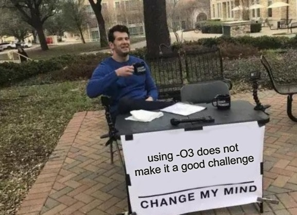
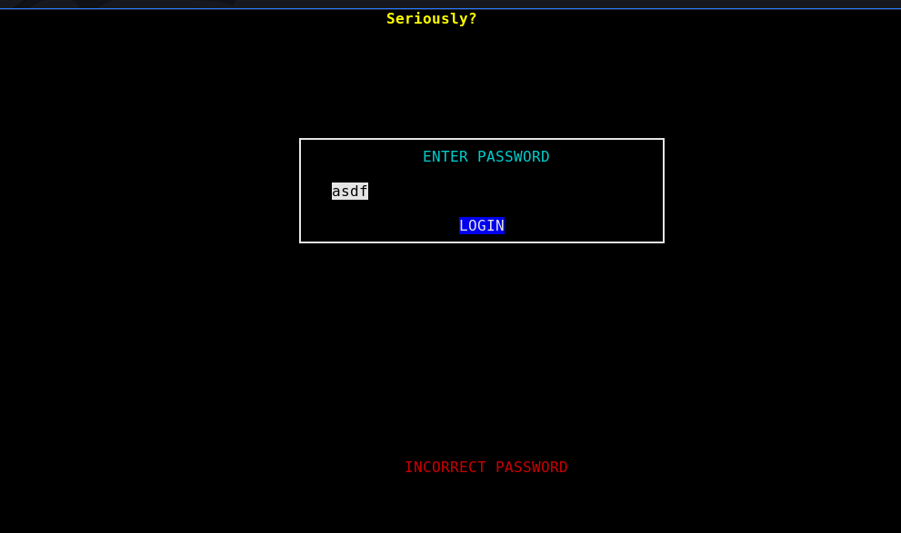
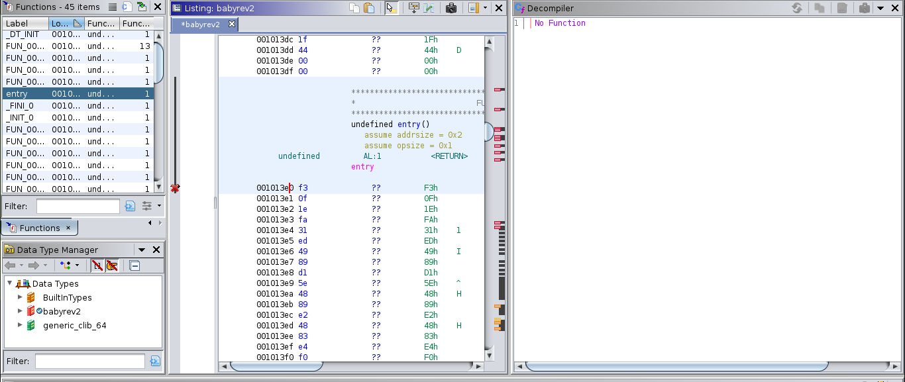
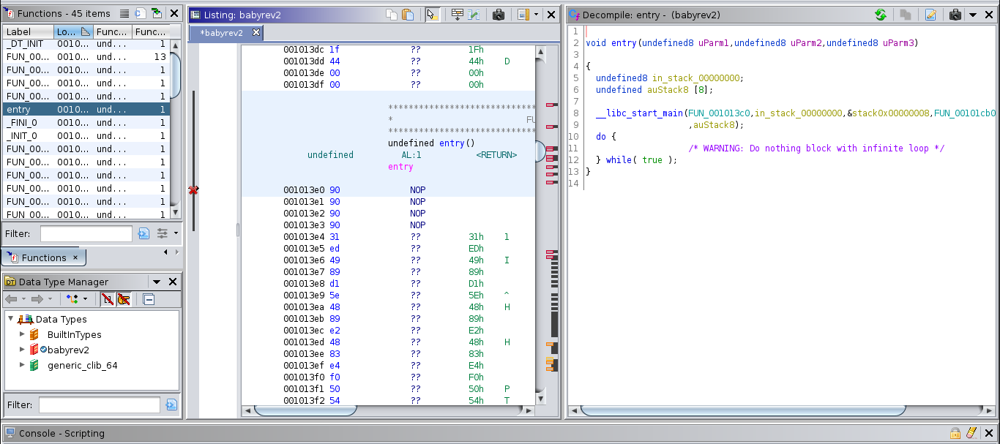
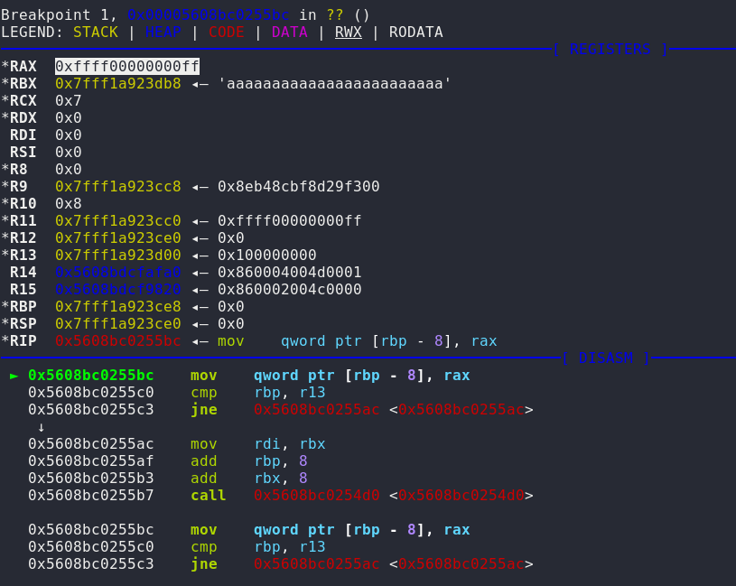

# BabyRE

## Description



```
Its BabyRE, you should be able to solve it without angr. even the stego guys solved this.
```
## Files
- [babyre](public/babyre) ELF file

Running `strings` can see some interesting strings:
```
 CORRECT PASSWORD 
INCORRECT PASSWORD
ENTER PASSWORD
LOGIN
Your terminal does not support color
Welcome to X3eRo0's Crackme 
Are you really Trying hard? :P 
lol you are so slow. 
go learn some hacking. 
Seriously? 
Yes, I know what year it is. 
NO. 
You still here? LOL 
Are you on Drugs? 
i did not used -O3 
Using angr for a babyre? 
```
Try run the program, it is a GUI terminal program:



Type anything then click enter will display "INCORRECT PASSWORD"

## Static Analysis
Opening in Ghidra, notice it cannot decompile directly

In the entry function:



I run `objdump` notice it has a weird instruction `endbr64` in front of every function:
```
00000000000013c0 <.text>:
    13c0:	f3 0f 1e fa          	endbr64 
```

Then I change the first 4 bytes to NOPs, then it decompiled properly:



After I analyse the whole program, found an interesting function:
```c
void FUN_00101600(undefined8 uParm1,uint uParm2,int iParm3,undefined8 uParm4)
{
  long lVar1;
  
  func_0x001012f0(uParm1,0x80000,0);
  lVar1 = FUN_00101560(uParm4);
  if (lVar1 == 0) {
    func_0x001012f0(uParm1,0x100,0);
    func_0x001012b0(uParm1,(ulong)uParm2,(ulong)(iParm3 + 2U)," CORRECT PASSWORD ");
  }
  else {
    func_0x001012f0(uParm1,0x400,0);
    func_0x001012b0(uParm1,(ulong)uParm2,(ulong)(iParm3 + 2U),"INCORRECT PASSWORD");
  }
}
```
Looks like `FUN_00101560` is what we looking for, because it return 0, it will print "CORRECT PASSWORD"

Analyze code of `FUN_00101560` (Enhanced version not the actual code):
```c
long FUN_00101560(char *input)

{
  int iVar1;
  long length;
  long output[4];
  length = strlen(input);

  if (length == 0x20) {
  	for (int i = 0; i < 4; ++i)
  	{
  		output[i] = FUN_001014d0(input);
  		input += 8;
  	}
    isEqual = memcmp(output,0x104020,0x20);
  }
  return isEqual;
}
```
As you can see the our input must be **0x20 (32) characters long**

It split our input into **4 pieces** and passed into another function 

It **compare the output with a global address**, if its equal then its correct

Lets see the new function:
```c
long FUN_001014d0(char* input)

{
  int iVar1;
  char eachByte;
  ulong *pointer;
  ulong output = 0;

  for (int i = 0; i < 8; ++i)
  {
    pointer = &output;
    eachByte = *(char *)(input + i);
    for (int j = 0; j < 8; ++j)
    {
      *(char *)pointer |= (eachByte & 1) << i;
      (char *)pointer++;
      eachByte = eachByte >> 1;
    }
  }
  return output;
}
```
As you can see, this function will split each byte into bits and store them into 8 different bytes

For example:
```
If input is 'aaaaaaaa'

1st character
'a' in ASCII -------------
                         | 
1st Bit          V       V
output -> 00000001       1
          00000000       0 
          00000000       0 
          00000000       0
          00000000       0
          00000001       1
          00000001       1
          00000000       0

2nd character
'a' in ASCII -------------
                         | 
2nd Bit         V        V
output -> 00000011       1
          00000000       0 
          00000000       0 
          00000000       0
          00000000       0
          00000011       1
          00000011       1
          00000000       0

Same for 3 until 8...

Final output will be:
output -> 11111111 -> 0x00FFFF00000000FF (In hex)
          00000000
          00000000
          00000000
          00000000
          11111111
          11111111
          00000000
```
You also can say it combine the input bits vertically then take the bytes horizontally

I try run GDB for the program and put 32 `a`'s for password (Run with `gdb -pid`)

And set a breakpoint when the function returns, as expected it returns `0xffff00000000ff`



Now is clear how to solve this, we have to reverse the output back to the original bit state

The `memcmp` compare with address `0x104020`:
```
00104020 a4              ??         A4h
00104021 ad              ??         ADh
00104022 c0              ??         C0h
00104023 a3              ??         A3h
00104024 fd              ??         FDh
00104025 7f              ??         7Fh    
00104026 ab              ??         ABh
00104027 00              ??         00h
00104028 e8              ??         E8h
00104029 d5              ??         D5h
0010402a e2              ??         E2h
0010402b 48              ??         48h    H
0010402c da              ??         DAh
0010402d bf              ??         BFh
0010402e fd              ??         FDh
0010402f 00              ??         00h
00104030 d1              ??         D1h
00104031 40              ??         40h    @
00104032 f2              ??         F2h
00104033 c4              ??         C4h
00104034 7b              ??         7Bh    {
00104035 bf              ??         BFh
00104036 76              ??         76h    v
00104037 00              ??         00h
00104038 87              ??         87h
00104039 07              ??         07h
0010403a d5              ??         D5h
0010403b ad              ??         ADh
0010403c ae              ??         AEh
0010403d 82              ??         82h
0010403e fd              ??         FDh
0010403f 00              ??         00h
```
It is 32 bytes, so it got 4 parts (8\*4=32)

Written a simple [python script](public/solve.py) and got the flag!!!
```py
text = bytes.fromhex("a4adc0a3fd7fab00e8d5e248dabffd00d140f2c47bbf76008707d5adae82fd00")
flag = [bytearray(8) for i in range(4)]

for part in range(4):
	for j in range(8):
		for index,t in enumerate(text[(part*8):(part*8)+8]):
			t = t >> j
			flag[part][j] |= (t&1) << index

print(b''.join(flag))
# b'zh3r0{4_b4byre_w1th0ut_-O3_XDXD}'
```

## Flag
```
zh3r0{4_b4byre_w1th0ut_-O3_XDXD}
```